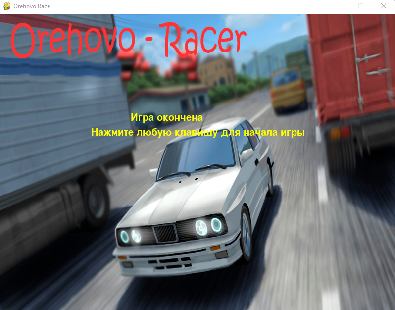

# О игре:

Данная игра представляет собой бесконечную аркадную гонку, суть которой заключается в достижении наибольшего расстояния
проезда, где игроку дается 3 жизни, с каждым врезанием жизнь убирается

## Как запустить?

Распакуйте архив с проектом "Orehovo-Racer". Запустите главную форму программы: Racer.py

## Что присутствует в игре?

На данный момент в игре есть 3 стадии, как их можно назвать.

1. Заставка игры
2. Сама игра
3. Конец игры, если вы врежетесь в другой автомобиль

Также в игре присутствует возможность увидеть свой текущий счет, а также свой лучший счет

## Управление в игре:

1. Движение: Есть 2 способа управления: 1 - На WASD (W - вперед, A - влево, S - назад, D - вправо); 2 - На стрелочки
2. Чтобы приступить к игре:
   Нажмите любую клавишу на клавиатуре
3. Чтобы замедлить скорость: X на клавиатуре
4. Чтобы сбросить счет: Z на клавиатуре
5. Чтобы выйти: Esc на клавиатуре

## Скриншоты игры

